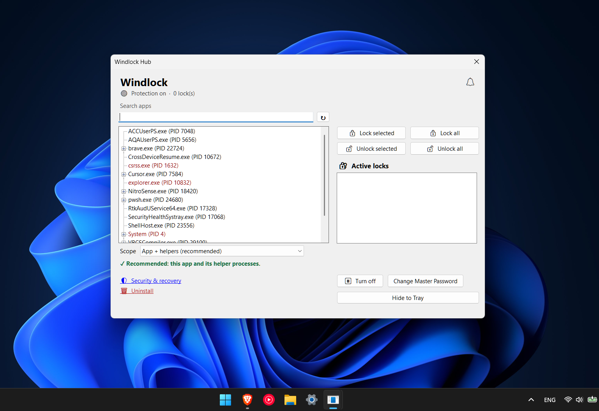
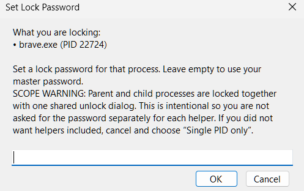
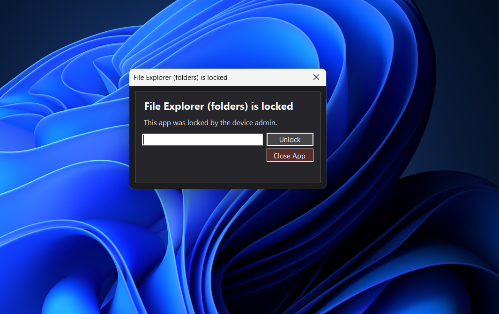
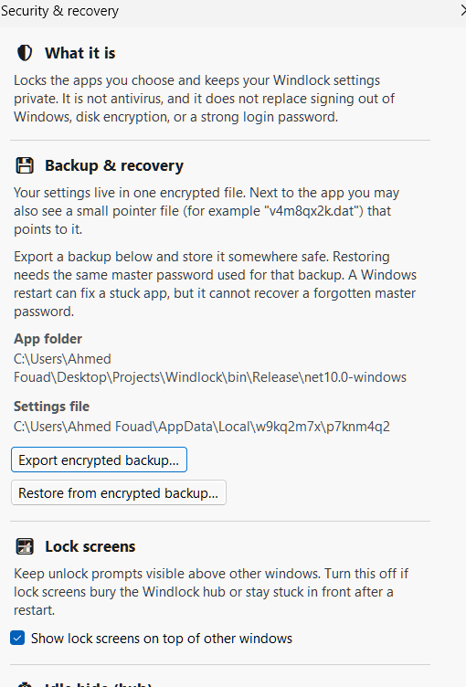
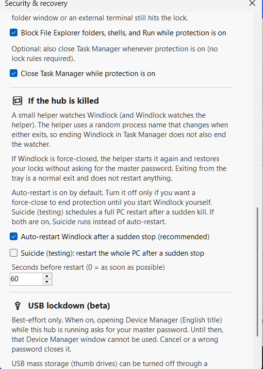

# Windlock

**Windlock** is a Windows desktop utility that locks running applications—and optionally File Explorer / shells—behind password overlays so others cannot use those windows until you unlock them. It targets shared PCs, parental controls, kiosk-style setups, and anyone who wants a practical **app locker for Windows** without enterprise-only tooling.

**Current release:** [v1.0.0](https://github.com/AF-MAHMOU/Windlock/releases/tag/v1.0.0)

## Screenshots

### Hub



### Set lock password



### Lock dialog



### Security & recovery — backup



### Security & recovery — resilience



## Features

- **Master password** with encrypted storage (opaque filename option on first run).
- **Lock selected processes**, **Lock All** visible apps, per-rule passwords, and scopes (single PID, all instances by name, or process tree).
- **System tools blacklist** (optional): silently closes File Explorer folders, Run (Win+R), Command Prompt, PowerShell, and Windows Terminal while protection is on; desktop/taskbar stay usable. Off by default. Task Manager can be closed while protection is on (recommended).
- **Hub UI** with tray mode, security alerts, encrypted backup/restore, watchdog auto-restart after force-close, and optional USB mass-storage lockdown (beta; admin required for registry-backed USB changes).

## Requirements

- **Windows** (desktop session).
- [.NET 10 **Desktop** Runtime](https://dotnet.microsoft.com/download/dotnet/10.0) for framework-dependent builds.

## Build from source

Only the project sources are required (no `bin/` / `obj/`). From this folder:

```bash
dotnet restore Windlock.csproj
dotnet build Windlock.csproj -c Release
```

Output: `bin/Release/net10.0-windows/Windlock.exe`

Optional single-file publish (see `Windlock.csproj` publish target + `StopPublishLock.ps1`).

## Security note

Windlock is a **session-level** deterrent: it overlays and restricts targeted windows. It is not a substitute for full disk encryption, Windows Defender Application Control, or Group Policy when you need strong isolation.

**Important:** Blocking File Explorer alone is not enough. Unlocked apps (editors, browsers, games) can still open or save files through their own dialogs. Lock those apps if you want stronger session protection.

## Repository

[github.com/AF-MAHMOU/Windlock](https://github.com/AF-MAHMOU/Windlock)
